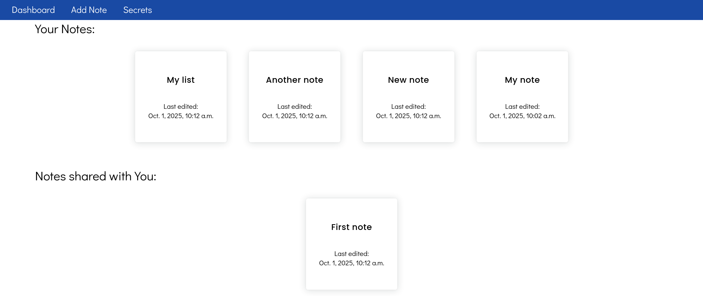

# Notepad-Webiste
Website where users can create and share notes between other users.

### Screenshots

##### Homepage 

##### Dashboard

##### Writing notes

More images can be found in the /img folder.

### Design
#### Core functionalities/choices:
<ul>
    <li> Fast - least time to create notes </li>
    <li> Simple/clean UI </li>
    <li> Few features, just basic write/read/edit/delete notes </li>
    <li> Notes are persistent and tied to a user </li>
    <li> Individual notes can be shared between users, but only owner can edit/delete </li>
    <li> Support for mobiles </li>
</ul>

#### Things to consider/ideas/for future updates:
<ul>
    <li> API to access notes</li>
    <li> Note encryption </li>
    <li> HTML tags allowed inside notes </li>
    <li> Auto deleting notes after some time </li>
    <li> Custom user created categories for notes </li>
</ul>
